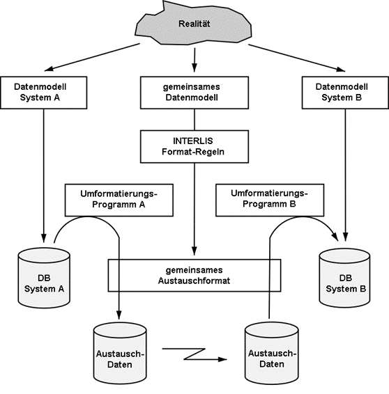
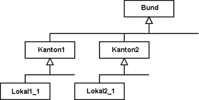
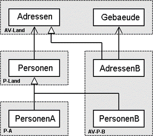
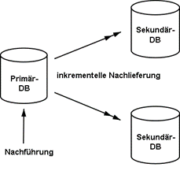
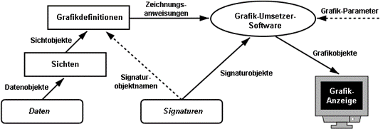
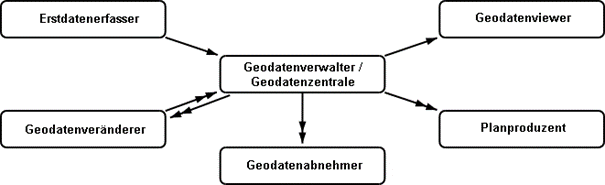
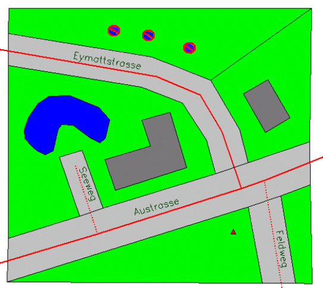

== Grundprinzipien

****
Kapitel 1 steht, bis auf die verwendeten Grafiken, noch nicht online zur Verfügung.
****

.Datentransfer zwischen verschiedenen Datenbanken über gemeinsames Datenmodell (Datenschema) beschrieben mit gemeinsamer Datenbeschreibungssprache.

.Spezialisierung der Modellierung eines Konzepts von Stufe Bund über kantonale (länderspezifische) bis lokale Stufe.

.Vererbungs-Hierarchie von Adresse, Person und Gebäude.

.Nachführung in der Primär-Datenbank und anschliessende Nachlieferung an Sekundär-Datenbanken (ein doppelter Pfeil bedeutet inkrementelle Nachlieferung).

.Grafikdefinitionen, die einerseits auf Daten und Sichten und andererseits auf Signaturen aufbauen, um da-raus eine Grafik zu erzeugen (abstrahierte Darstellung).

.Die verschiedenen Einsatzgebiete von INTERLIS (ein doppelter Pfeil bedeutet inkrementelle Nachlieferung).

.Das kleine Beispiel Roads.

